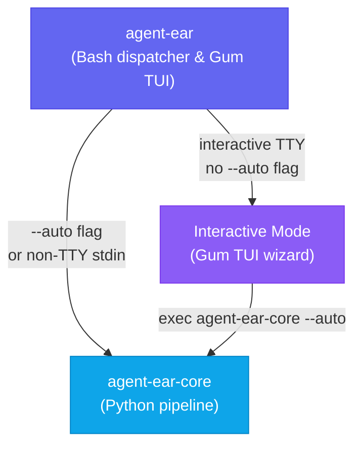
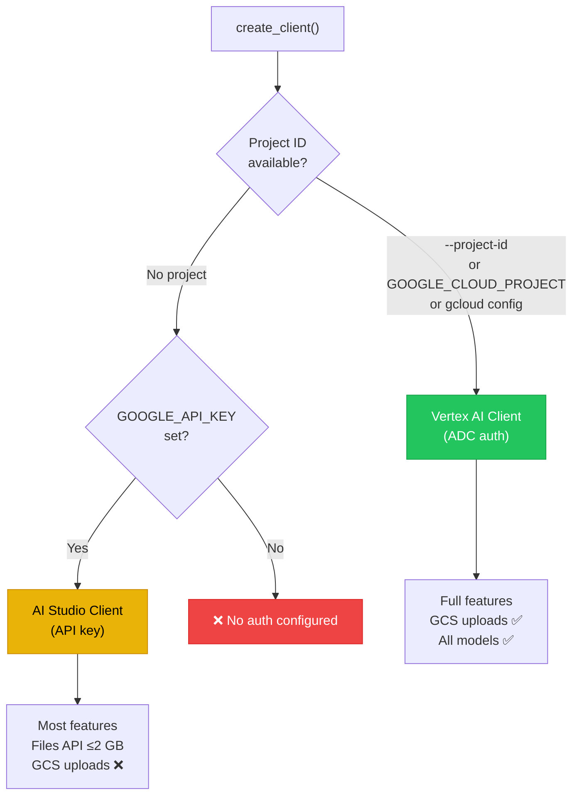
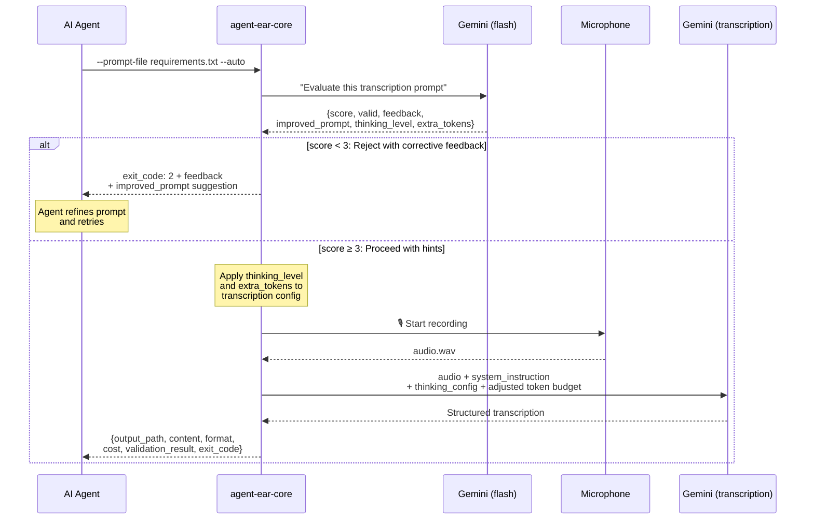
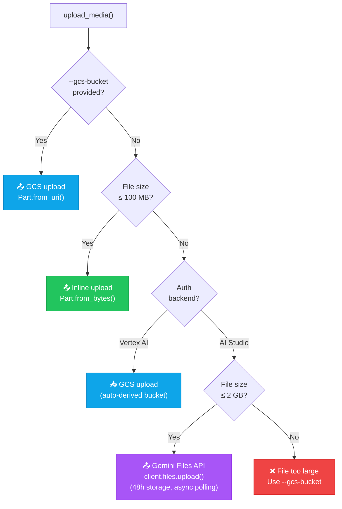
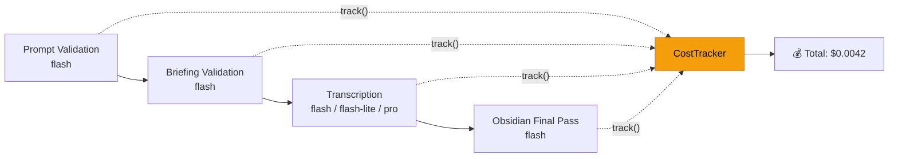
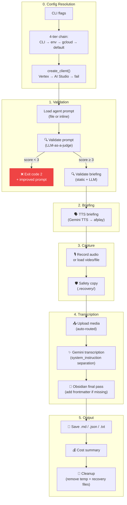

# The Architecture
 
Agent-ear has two operational modes. For human users, agent-ear has a bash wrapper that creates a UI. For AI agents, agent-ear works autonomously with the core python pipeline. For the purposes of this document, 'agent-ear' will hereafter refer to the bash dispatcher and gum TUI. 'agent-ear-core' will refer to the python pipeline.

## Operational modes
Here is a graphical overview of the agent-ear architecture:



As you can see, agent-ear routes non-interactive calls (made by AI agents, using --auto flag or piped in via non-interactive command line (non-TTY stdin)) directly to agent-ear-core. All interactive calls (by humans) are routed through the TUI wizard using Gum.

| Entry point | What it actually is | Purpose |
|:------------|:-------------------|:--------|
| `agent-ear` | Bash script (Nix `writeShellApplication` wrapping `scripts/agent-ear.sh`) | The main interface. Routes non-interactive calls directly to core, otherwise launches the guided TUI wizard using [Gum](https://github.com/charmbracelet/gum). |
| `agent-ear-core` | Python package (Nix `makeWrapper` around the Python venv) | The actual pipeline: validate → brief → record → transcribe. |

## agent-ear: Bash dispatcher and Gum TUI

To handle the different needs of humans and AI agents cleanly, `agent-ear` acts as a smart dispatcher. The Gum TUI wizard walks human users through every decision with styled menus and confirmation screens, then delegates to `agent-ear-core --auto` with the assembled flags.

Agent-ear's routing logic at the very top of the script is trivial:

```bash
# Any of these flags → bypass interactive, go straight to core
for arg in "$@"; do
  case "$arg" in
    --auto|--help|-h) exec agent-ear-core "$@" ;;
  esac
done

# Not a TTY (piped, cron, agent) → core
[[ ! -t 0 ]] && exec agent-ear-core "$@"
```

This separation means agents never see the TUI code loading, and humans never need to know the flag syntax. Both paths ultimately `exec` into the same Python entry point (`agent-ear-core`), which does all the real work.

## agent-ear-core: Python pipeline

AI agents work best with `--auto` and structured output. They pass a system prompt, skip interactive menus, and parse the result. They don't have a TTY (no interactive terminal input/output).

## Auth Backend Design

To maximize easy onboarding, agent-ear offers two auth paths. Here you can see a graphical representation of the available auth paths:



For most users, Google AI studio will be the optimal choice, with the least amount of onboarding required. Google AI Studio needs one API key and zero infrastructure. It has no GCS support, but AI Studio can still handle files up to 2 GB via the Gemini Files API. Only files exceeding 2 GB require Vertex AI with GCS staging.

If you're handling large audio/video files (larger than 2GB), you may want to opt for Vertex AI. Vertex AI gives you GCS uploads for large files, project-scoped billing, and enterprise features. However, setting up Vertex AI requires a GCP project, enabled APIs, and Application Default Credentials.

This is order of selection for authentication credentials (= the order in which authentication is selected if available):

1. **Vertex AI first** — if a project ID exists (from flag, env var, or `gcloud config`), use it. This is the "batteries included" path.
2. **AI Studio fallback** — if no project but `GOOGLE_API_KEY` is set, use it. Zero friction.
3. **Fail with clear instructions** — if neither is configured, print exactly what to do.

You can upgrade from AI Studio to Vertex AI by setting one environment variable.

## Prompt Validation: LLM-as-a-Judge



Prompt validation makes agent-ear more efficient than transcription tools. 

In a regular transcription tool, an AI agent may construct a vague prompt like _"process the audio"_, the human speaks for 10 minutes, and the transcription comes back as an unusable blob. The human's time is wasted, and the agent has to retry. 

With agent-ear, prompt validation catches this _before_ any recording happens. A separate Gemini call (using `gemini-3.5-flash`) scores the prompt on five criteria:

1. **Instruction clarity** — does it specify what to extract?
2. **Output structure** — does it define the expected format?
3. **Grounding** — does it require references to the actual audio?
4. **Negative constraints** — does it say what to avoid?
5. **Completeness** — does it handle edge cases?

If the score is below 3/5, the pipeline exits with code `2` and returns an improved prompt suggestion. The agent can refine and retry without ever bothering the human.

Beyond scoring, the validator also emits **transcription hints** — a `thinking_level` recommendation (`low`, `medium`, or `high`) and an `extra_tokens` budget adjustment (0–16384). These hints configure the downstream transcription model's reasoning effort and output token budget, optimising quality for complex prompts without manual tuning.

> [!NOTE]
> Validation is deliberately **fail-open**: if the validation call itself errors (network issue, quota), the pipeline proceeds anyway. This is part of facilitating off-line use of the tool.

The same pattern applies to TTS briefings — a two-layer check (static regex checks for free, then LLM-as-a-judge) catches non-speakable content like markdown headers, URLs, and pacing mismatches before the TTS API is called.

## Media Upload Strategy



### Upload Routing

agent-ear handles audio and video files of any practical size. Upload routing is fully automatic — you use the same CLI commands regardless of file size.

Under the hood, files ≤ 100 MB are uploaded **inline** (`Part.from_bytes`) for speed — no round-trip, no polling. For larger files, agent-ear transparently switches backend:

- **Vertex AI users** → GCS staging. The file is uploaded to a Google Cloud Storage bucket and a `gs://` URI is passed to Gemini.
- **AI Studio users** → Gemini Files API. The file is uploaded to Google's servers via `client.files.upload()`, stored for 48 hours at no cost, and referenced by file name. This supports files up to 2 GB.

If `--gcs-bucket` is explicitly provided (via flag or `AGENT_EAR_GCS_BUCKET` env var), GCS is used regardless of file size or auth backend.

### 7-day lifecycle

It is recommended that you use a 7-day lifecycle when using agent-ear. Staging files are only needed for the duration of a single Gemini API call, which takes a few minutes at most. A 7-day lifecycle rule is generous enough to survive retries and debugging, but short enough that forgotten files don't accumulate.

## Cost Tracking

Every Gemini API call in the pipeline is tracked through a `CostTracker` that threads through all phases:



### What gets counted

Each API response includes `usage_metadata` with four token types:

| Token type | Billing rate | Notes |
|:-----------|:-------------|:------|
| Input tokens | Standard rate | Prompt + audio/video content |
| Output tokens | Higher rate | Generated transcription |
| Thinking tokens | Output rate | Chain-of-thought (billed as output) |
| Cached tokens | Reduced rate (~10× cheaper) | Re-used context across calls |

The tracker computes a dollar estimate per call using a built-in pricing table. This approximation helps agents make cost-aware decisions (e.g., choosing `flash-lite` over `pro` when quality requirements are modest).

For current per-model pricing, see the [Google AI pricing page](https://ai.google.dev/pricing) and [Vertex AI pricing page](https://cloud.google.com/vertex-ai/generative-ai/pricing).

For current per-model pricing, see the [Google AI pricing page](https://ai.google.dev/pricing) and [Vertex AI pricing page](https://cloud.google.com/vertex-ai/generative-ai/pricing).

### Per-call reporting

At the end of a pipeline run, you see:

```
💰 gemini-3.5-flash: $0.0001 (in: 1,024, out: 256, think: 64)
💰 gemini-3.5-flash: $0.0003 (in: 18,432, out: 512, think: 128)
💰 Total: $0.0004
```

The first line is prompt validation; the second is transcription. For a typical voice note, the total cost is well under a cent.

## The Pipeline, End to End

Putting it all together, here's the full data flow through `agent-ear-core`:



Key design decisions visible in this flow:

- **System instruction separation** — the agent's prompt goes in `system_instruction`, not mixed with the audio content. This follows Gemini best practices for constrained generation.
- **Safety copy before transcription** — recordings are backed up to `.recovery/` immediately after capture, before any API call. If transcription crashes, the recording survives.
- **Cleanup only on success** — temp files and recovery copies are only deleted after the output is saved. Partial failures preserve everything.
- **Dynamic token budgets** — output token limits scale with recording duration (~200 tokens per minute of speech, floor 8192, cap 65536). Video defaults to 32768. The prompt validator can add up to 16384 extra tokens via its `extra_tokens` hint.
- **Validator-driven reasoning** — the prompt validator emits `thinking_level` and `extra_tokens` hints that configure the transcription model's reasoning depth and token budget, optimising quality without manual tuning.
