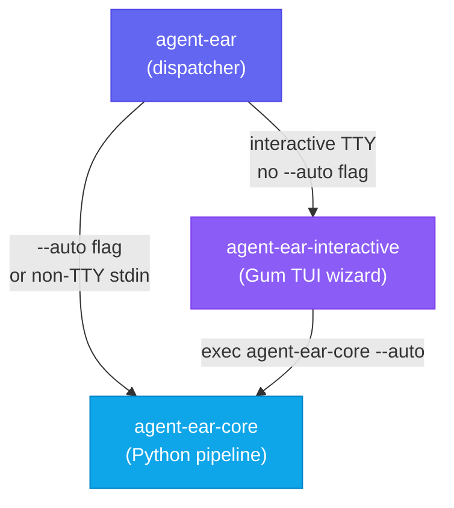
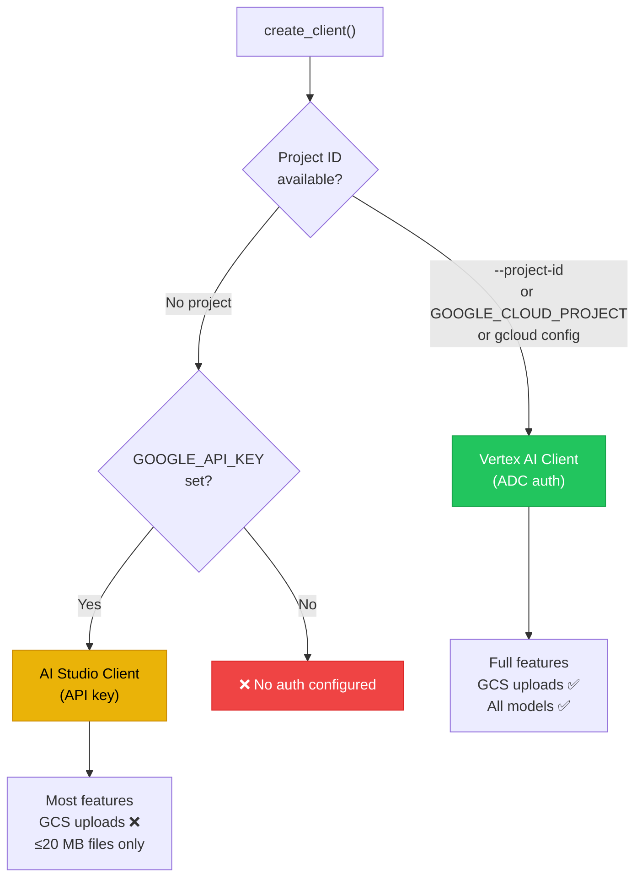
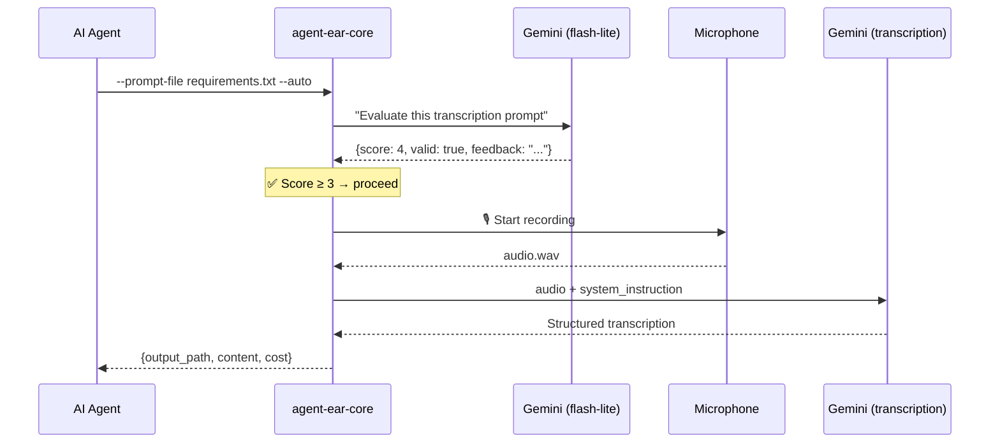
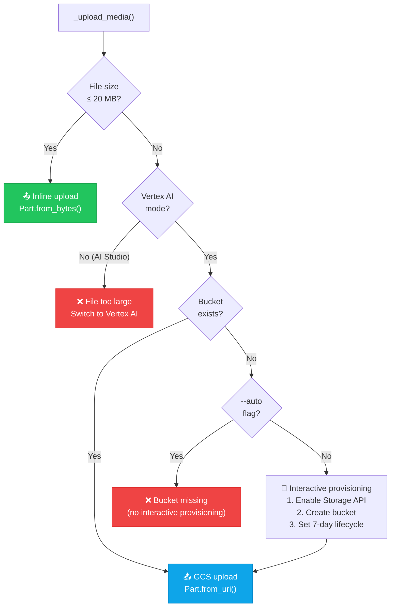
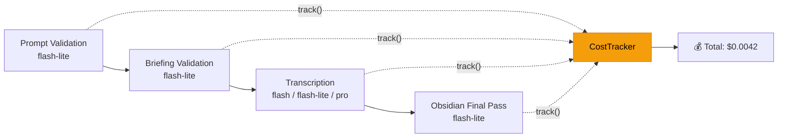

# Architecture: Why Three Binaries?

agent-ear could have been a single script. Instead, it's three binaries, two auth backends, and a validation layer that calls the LLM _before_ you even start recording. This page explains why.

## The 3-Binary Design



| Binary | Language | Purpose |
|:-------|:---------|:--------|
| `agent-ear` | Bash | Smart dispatcher — routes based on CLI flags and TTY state |
| `agent-ear-core` | Python | The actual pipeline: validate → brief → record → transcribe |
| `agent-ear-interactive` | Bash + [Gum](https://github.com/charmbracelet/gum) | Terminal wizard with guided mode selection and config |

### Why not one binary?

Two fundamentally different consumers need different interfaces:

**AI agents** need `--auto` and structured output. They pass a system prompt, skip interactive menus, and parse the result. They don't have a TTY. The Python backend handles this natively.

**Humans** need guidance. Which mode? Which model? What's a "system prompt"? The Gum TUI wizard walks them through every decision with styled menus and confirmation screens, then delegates to `agent-ear-core --auto` with the assembled flags.

The **dispatcher** is the glue. Its routing logic is trivial:

```bash
# Any of these flags → bypass interactive, go straight to core
for arg in "$@"; do
  case "$arg" in
    --auto|--help|-h) exec agent-ear-core "$@" ;;
  esac
done

# Not a TTY (piped, cron, agent) → core
[[ ! -t 0 ]] && exec agent-ear-core "$@"

# Interactive human → TUI wizard
exec agent-ear-interactive "$@"
```

This separation means agents never see the TUI code, and humans never need to know the flag syntax. Both paths converge on the same Python pipeline.

## Auth Backend Design



### Why two auth paths?

The honest answer: **onboarding friction kills tools.**

Vertex AI is the "right" answer for production — it gives you GCS uploads for large files, project-scoped billing, and enterprise features. But setting it up requires a GCP project, enabled APIs, and Application Default Credentials. That's a 5-minute setup that filters out 90% of people who just want to try the tool.

Google AI Studio needs one API key and zero infrastructure. You paste it, export it, and you're running in 60 seconds. The tradeoff is no GCS support, which means files must stay under 20 MB (the Gemini inline upload limit).

The resolution order is intentional:

1. **Vertex AI first** — if a project ID exists (from flag, env var, or `gcloud config`), use it. This is the "batteries included" path.
2. **AI Studio fallback** — if no project but `GOOGLE_API_KEY` is set, use it. Zero friction.
3. **Fail with clear instructions** — if neither is configured, print exactly what to do.

This means upgrading from AI Studio to Vertex AI is just setting one environment variable — no code changes, no config files.

## Prompt Validation: LLM-as-a-Judge



### Why validate before recording?

Imagine this: an AI agent constructs a vague prompt like _"process the audio"_, the human speaks for 10 minutes, and the transcription comes back as an unusable blob. The human's time is wasted, and the agent has to retry.

Prompt validation catches this _before_ any recording happens. A separate Gemini call (using the cheapest model, `gemini-3.1-flash-lite-preview`) scores the prompt on five criteria:

1. **Instruction clarity** — does it specify what to extract?
2. **Output structure** — does it define the expected format?
3. **Grounding** — does it require references to the actual audio?
4. **Negative constraints** — does it say what to avoid?
5. **Completeness** — does it handle edge cases?

If the score is below 3/5, the pipeline exits with code `2` and returns an improved prompt suggestion. The agent can refine and retry without ever bothering the human.

> [!NOTE]
> Validation is deliberately **fail-open**: if the validation call itself errors (network issue, quota), the pipeline proceeds anyway. The goal is to catch bad prompts, not block good ones.

The same pattern applies to TTS briefings — a two-layer check (static regex checks for free, then LLM-as-a-judge) catches non-speakable content like markdown headers, URLs, and pacing mismatches before the TTS API is called.

## GCS Staging: Why Not Always Inline?



### The 20 MB problem

The Gemini API accepts inline uploads up to 20 MB. That covers most voice recordings (a 10-minute mono WAV at 44.1 kHz is about 50 MB, but shorter recordings fit), but videos easily exceed this — a 5-minute 720p MP4 is typically 30–80 MB.

For anything over 20 MB, agent-ear uploads to a Google Cloud Storage bucket and passes a `gs://` URI to Gemini instead. This requires Vertex AI mode (a GCP project with credentials).

### Auto-provisioning

First-time users hit a cold-start problem: they don't have a GCS bucket yet. The interactive provisioning flow handles this:

1. **Check the Storage API** — is `storage.googleapis.com` enabled on the project? If not, offer to enable it.
2. **Check the bucket** — does `{project}-transcribe-staging` exist? If not, offer to create it.
3. **Set lifecycle rules** — the bucket gets a 7-day auto-delete rule on all objects. Staging files are ephemeral; the transcription output is what matters.

In `--auto` mode (agent-driven), provisioning is skipped and errors are raised instead. Agents shouldn't silently create cloud resources that cost money.

### Why 7-day lifecycle?

Staging files are only needed for the duration of a single Gemini API call — a few minutes at most. A 7-day lifecycle rule is generous enough to survive retries and debugging, but short enough that forgotten files don't accumulate costs. At Google Cloud Storage pricing (~$0.02/GB/month), even leaving files for 7 days costs effectively nothing.

## Cost Tracking

Every Gemini API call in the pipeline is tracked through a `CostTracker` that threads through all phases:



### What gets counted

Each API response includes `usage_metadata` with four token types:

| Token type | Billing rate | Notes |
|:-----------|:-------------|:------|
| Input tokens | Standard rate | Prompt + audio/video content |
| Output tokens | Higher rate | Generated transcription |
| Thinking tokens | Output rate | Chain-of-thought (billed as output) |
| Cached tokens | Reduced rate (~10× cheaper) | Re-used context across calls |

The tracker computes a dollar estimate per call using a built-in pricing table. This isn't a bill — it's an approximation to help agents make cost-aware decisions (e.g., choosing `flash-lite` over `pro` when quality requirements are modest).

### Per-call reporting

At the end of a pipeline run, you see:

```
💰 gemini-3.1-flash-lite-preview: $0.0001 (in: 1,024, out: 256, think: 64)
💰 gemini-3.1-flash-lite-preview: $0.0003 (in: 18,432, out: 512, think: 128)
💰 Total: $0.0004
```

The first line is prompt validation; the second is transcription. For a typical voice note, the total cost is well under a cent.

## The Pipeline, End to End

Putting it all together, here's the full data flow through `agent-ear-core`:


Key design decisions visible in this flow:

- **System instruction separation** — the agent's prompt goes in `system_instruction`, not mixed with the audio content. This follows Gemini best practices for constrained generation.
- **Safety copy before transcription** — recordings are backed up to `.recovery/` immediately after capture, before any API call. If transcription crashes, the recording survives.
- **Cleanup only on success** — temp files and recovery copies are only deleted after the output is saved. Partial failures preserve everything.
- **Dynamic token budgets** — for audio over 2 minutes, the output token limit scales with recording duration (~200 tokens per minute of speech), preventing truncation of long recordings.
