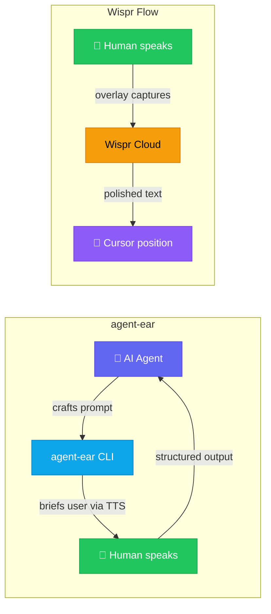

# Comparison with Wispr Flow

agent-ear and [Wispr Flow](https://wisprflow.ai) are both voice tools built for developer productivity, but they solve fundamentally different problems. This page explains where each tool fits and why agent-ear's architecture leads to different trade-offs.

## The core difference

The simplest way to understand the split: **who is driving?**

| | **agent-ear** | **Wispr Flow** |
|:--|:--|:--|
| **Core verb** | *Comprehend* | *Dictate* |
| **Who drives it** | An AI agent | A human typing with their voice |
| **Output target** | Structured files (YAML/JSON/Markdown) for agent consumption | Inline text at the cursor, for human reading |
| **License** | Apache 2.0 / MIT (open source) | Proprietary SaaS |

## Transcription architecture

The tools differ at the model layer, and this shapes everything downstream.

### agent-ear: Multimodal-native

Audio and video are sent directly to a multimodal LLM (Gemini). There is no speech-to-text intermediary. This preserves **prosodic context** - emphasis, tone, and pacing carry semantic meaning that a text transcript discards.

The agent supplies a constrained extraction prompt that shapes what the model extracts, and validation ensures that prompt is well-formed before any recording starts. The output is structured data, not plain text.

### Wispr Flow: STT + AI polish

Audio is processed through a cloud speech-to-text pipeline, then passed through an AI post-processing layer that removes filler words, corrects grammar, and adjusts tone based on the active application. The output is polished natural-language text inserted directly at the cursor.

> [!NOTE]
> Neither tool offers a true offline mode. agent-ear processes recordings locally but requires a cloud API for transcription. Wispr Flow is fully cloud-dependent.

## Feature comparison

| Feature | **agent-ear** | **Wispr Flow** |
|:--------|:---:|:---:|
| Live microphone capture | ✅ | ✅ |
| Filler word removal | ⚙️ (via prompt) | ✅ |
| Context-aware formatting | ✅ (via agent prompt) | ✅ (via app detection) |
| Video transcription | ✅ (local + YouTube) | ❌ |
| TTS briefing (agent → human) | ✅ | ❌ |
| Prompt-constrained extraction | ✅ | ❌ |
| Multi-speaker transcription | ⚙️ (via prompt template) | ❌ |
| WCAG video descriptions | ✅ (default video prompt) | ❌ |
| Command mode (transform selected text) | ❌ | ✅ (Pro) |
| Cursor-position insertion | ❌ (writes to file) | ✅ |
| Works in any app (overlay) | ❌ (CLI only) | ✅ |
| Custom dictionary | ❌ (prompt-driven) | ✅ |
| iOS / Android | ❌ | ✅ |
| 100+ languages | ✅ | ✅ |

## Cost model

### agent-ear, Pay-per-use (API)

There is no subscription. You pay only for API tokens consumed. A typical 5-minute voice note costs **under $0.001**. A free tier is available via Google AI Studio.

See [Architecture Cost Tracking](architecture.md#cost-tracking) for the full per-model pricing table and per-call reporting.

### Wispr Flow — Subscription

| Plan | Price |
|:-----|:------|
| Basic (Free) | 2,000 words/week |
| Pro | $15/month ($144/year) |
| Teams | $12/user/month (annual) |
| Enterprise | Custom |

## Privacy and data

| Concern | **agent-ear** | **Wispr Flow** |
|:--------|:--|:--|
| Audio processing | Google Cloud (Vertex AI or AI Studio) | Wispr cloud servers |
| Enterprise data agreements | ✅ Vertex AI (Google Cloud ToS, DPA, region control) | ❌ |
| Screen capture | ❌ Never | ✅ For context awareness |
| Local-only option | Partial (recording is local; transcription is cloud) | ❌ |
| Open-source audit | ✅ Full source available | ❌ Proprietary |
| Data retention control | You control GCS bucket lifecycle | Wispr "Privacy Mode" toggle |

> [!WARNING]
> Wispr Flow captures screenshots of your active window by default to provide context-aware formatting. This is a significant privacy consideration for proprietary codebases. The feature can be disabled in settings.

> [!NOTE]
> When using Vertex AI, audio is processed under Google Cloud's enterprise terms of service and data processing agreements. Google does not use your data to train models, and you can choose the processing region. AI Studio uses the standard Google AI terms, which offer fewer contractual guarantees. For sensitive or regulated workloads, Vertex AI is the recommended backend.

## Developer workflow integration

### agent-ear

agent-ear is designed for **agent consumption**. The AI agent decides *what* to ask, *how* to constrain the transcript, and *what to do* with the result. Output is structured data that feeds directly into downstream automation.

Typical use cases:

- Meeting minutes → action items for a project tracker
- Voice memos → structured notes with YAML frontmatter
- Video lectures → summaries with timestamps
- Agent-driven data collection from a human expert

Integration surface: AI agent skills (Antigravity, Gemini CLI), shell scripts, CI pipelines.

### Wispr Flow

Wispr Flow is designed as a **keyboard replacement**. The human speaks naturally and polished text appears wherever the cursor is, across any application on the OS.

Typical use cases:

- Dictating prompts into Cursor, Windsurf, or Claude Desktop
- Writing Slack messages, emails, and PR descriptions
- Drafting documentation hands-free
- Reducing keyboard strain while maintaining flow

Integration surface: OS-level overlay (macOS, Windows, iOS) — works in any app without configuration.

## When to use which

| Scenario | Recommended |
|:---------|:------------|
| Agent needs to collect structured voice data from a human | **agent-ear** |
| Transcribing a meeting with action items for an agent to process | **agent-ear** |
| Summarising a YouTube video or lecture recording | **agent-ear** |
| Building an automated voice pipeline in CI/scripts | **agent-ear** |
| Privacy-sensitive codebase (no screen capture) | **agent-ear** |
| Speaking a quick prompt into an IDE or chat app | **Wispr Flow** |
| Dictating documentation hands-free while pacing | **Wispr Flow** |
| Replacing typing across all desktop apps | **Wispr Flow** |

## Summary

These tools are **complementary, not competing**.

- **agent-ear** is infrastructure — a programmable voice pipeline where the *agent* is the consumer. It comprehends media, not just transcribes it.
- **Wispr Flow** is a productivity app — a polished overlay where the *human* replaces their keyboard with their voice.

You could use Wispr Flow to dictate a prompt into your IDE, and agent-ear to have the agent collect structured voice data from you in response. They address different links in the same chain.
