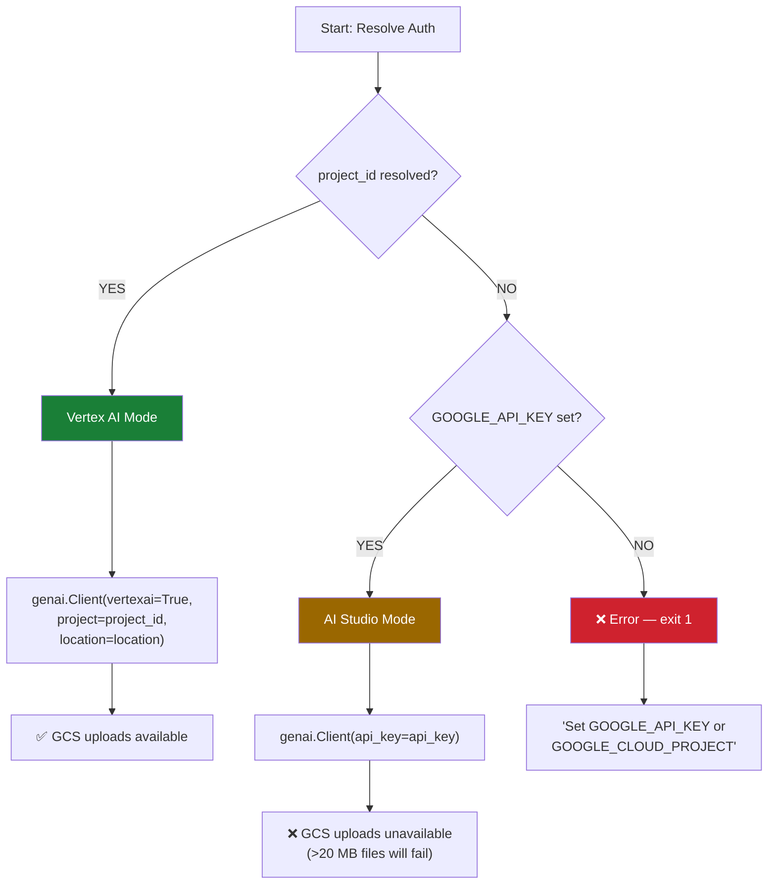
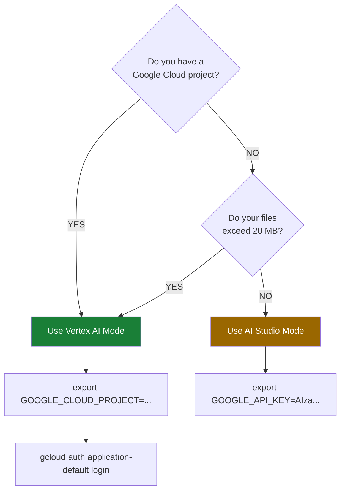

---
tags:
  - reference
  - authentication
  - agent-ear
creation_date: 2026-05-21
status: active
category: Resource
---

# Authentication

> [!NOTE] Diátaxis: Reference
> This is **information-oriented** documentation. It describes the complete authentication resolution logic, backend capabilities, and error diagnostics. For setup instructions, see the [[How-to Guides]].

## Overview

agent-ear supports two mutually exclusive authentication backends:

| Backend | Auth Method | Capabilities |
|:--------|:------------|:-------------|
| **Vertex AI** | Application Default Credentials (ADC) + GCP project | Full — all features including GCS staging |
| **Google AI Studio** | `GOOGLE_API_KEY` | Most features — no GCS staging for large files |

The backend is selected automatically based on whether a GCP project ID can be resolved.

---

## Auth Resolution Flow



---

## Resolution Chains

### Project ID

The project ID determines whether Vertex AI mode activates. It is resolved in this order:

```
--project-id flag
  → GOOGLE_CLOUD_PROJECT env var
    → gcloud config get-value project
      → None (fall through to AI Studio)
```

| Source | Example |
|:-------|:--------|
| CLI flag | `agent-ear --auto --project-id my-project` |
| Environment | `export GOOGLE_CLOUD_PROJECT="my-project"` |
| gcloud config | `gcloud config set project my-project` |

### Location

The location controls which regional Gemini endpoint is used:

```
--location flag
  → GOOGLE_CLOUD_LOCATION env var
    → gcloud config get-value compute/region
      → "global"
```

| Source | Example |
|:-------|:--------|
| CLI flag | `agent-ear --auto --location us-central1` |
| Environment | `export GOOGLE_CLOUD_LOCATION="us-central1"` |
| gcloud config | `gcloud config set compute/region us-central1` |
| Default | `global` (routes to nearest available region) |

### API Key

No resolution chain — the key is read directly from `GOOGLE_API_KEY`:

```
GOOGLE_API_KEY env var → None
```

---

## Feature Matrix

| Feature | Vertex AI | AI Studio |
|:--------|:---------:|:---------:|
| Audio transcription (≤20 MB) | ✅ | ✅ |
| Video transcription (≤20 MB) | ✅ | ✅ |
| YouTube download + transcribe | ✅ | ✅ |
| TTS briefing | ✅ | ✅ |
| Prompt validation | ✅ | ✅ |
| GCS staging (>20 MB files) | ✅ | ❌ |
| GCS auto-provisioning | ✅ | ❌ |

> [!IMPORTANT]
> The 20 MB limit for AI Studio is imposed by the Gemini API's inline data upload limit. Files above this threshold **must** be staged via GCS, which requires Vertex AI mode.

---

## Application Default Credentials (ADC)

Vertex AI mode authenticates using Google Cloud's Application Default Credentials. The ADC resolution order is:

1. `GOOGLE_APPLICATION_CREDENTIALS` environment variable (path to service account key JSON)
2. User credentials from `gcloud auth application-default login`
3. Attached service account (GCE, Cloud Run, GKE)
4. Workload identity federation

For local development, step 2 is the standard:

```bash
gcloud auth application-default login
```

For CI/CD and headless environments, use a service account key (step 1) or workload identity (step 4).

See [[environment-variables#GOOGLE_APPLICATION_CREDENTIALS]] for details on the service account key path.

---

## Error Messages and Resolutions

### No Authentication Configured

**Message:**

```
Error: No authentication configured.
Set GOOGLE_API_KEY for Google AI Studio, or
Set GOOGLE_CLOUD_PROJECT + run: gcloud auth application-default login
```

**Cause:** Neither a GCP project nor an API key could be resolved.

**Resolution:**

Choose one:

```bash
# Option A: AI Studio (quickest)
export GOOGLE_API_KEY="AIza..."

# Option B: Vertex AI (full features)
export GOOGLE_CLOUD_PROJECT="my-project"
gcloud auth application-default login
```

---

### Unauthenticated (Vertex AI)

**Message:**

```
google.api_core.exceptions.Unauthenticated: 401 Request had invalid authentication credentials.
```

**Cause:** Vertex AI mode is active but ADC credentials are missing or expired.

**Resolution:**

```bash
gcloud auth application-default login
```

If using a service account:

```bash
export GOOGLE_APPLICATION_CREDENTIALS="/path/to/key.json"
```

---

### Permission Denied

**Message:**

```
google.api_core.exceptions.PermissionDenied: 403 ...
```

**Cause:** The authenticated principal lacks permissions. Most commonly, the Vertex AI API is not enabled on the project.

**Resolution:**

```bash
# Enable the Vertex AI API
gcloud services enable aiplatform.googleapis.com --project=my-project

# If GCS errors, also enable:
gcloud services enable storage.googleapis.com --project=my-project
```

Verify the principal has these roles:

| Role | Purpose |
|:-----|:--------|
| `roles/aiplatform.user` | Gemini API access |
| `roles/storage.admin` | GCS bucket creation and file upload |

---

### Large File in AI Studio Mode

**Message:**

```
Error: GCS staging requires a Google Cloud project (Vertex AI mode).
File size (XX MB) exceeds the 20 MB inline upload limit.
```

**Cause:** A media file exceeds 20 MB, but agent-ear is running in AI Studio mode which cannot stage files to GCS.

**Resolution:**

Switch to Vertex AI mode:

```bash
export GOOGLE_CLOUD_PROJECT="my-project"
gcloud auth application-default login
agent-ear --auto --video ./large-file.mp4
```

---

## Decision Guide



---

## See Also

- [[cli#model--project]] — CLI flags for project and model configuration
- [[environment-variables]] — Complete environment variable reference
- [[environment-variables#GOOGLE_API_KEY]] — AI Studio key setup
- [[environment-variables#GOOGLE_CLOUD_PROJECT]] — GCP project configuration
